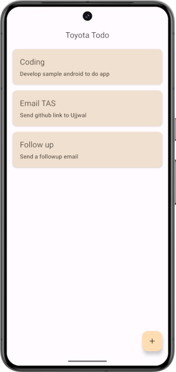
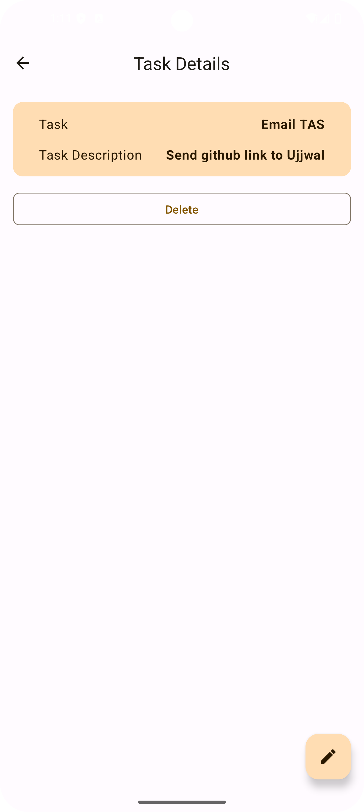

## NoteTakingApp

List of tasks to do

  

Clicking a task lead to details, user can edit the task then

  

Adding a new task

  

## Sample

You can download sample apk file [here](https://github.com/mekete/ToyotaTodo/README.md)

## Overview

Simple NoteTaking android app built with Jetpack Compose and Room

TodoDemoApp is an Android application developed with Jetpack Compose and Room Database, showcasing advanced Android app development techniques. Includes Hilt for dependency injection, significantly improving the architecture and testability of the app.

Key aspects of the project now include:

- **Integration of Room Database for Persistent Data Storage**: Utilizing Room Database for robust data persistence
- **Implementation of ViewModel**: Managing UI-related data in a lifecycle-conscious way with ViewModel, ensuring data persistence across configuration changes.
- **Usage of Kotlin Coroutines Flow**: Employing Kotlin coroutines Flow for efficient database operations, enhancing app responsiveness.
- **Incorporation of Hilt for Dependency Injection**: Enhancing the app's architecture and testing capabilities by integrating Hilt, enabling more maintainable code and isolated testing environments.

## Versions

- **MinSdk 24**
- **TargetSdk 35**
- **Android Studio Koala | 2024.1.1**
- **Gradle 8.7**

## Getting Started

1. Clone the repository to your local machine.
2. Open the project in the latest Android Studio 
3. Run the app on an emulator or physical device to see the app in action.

